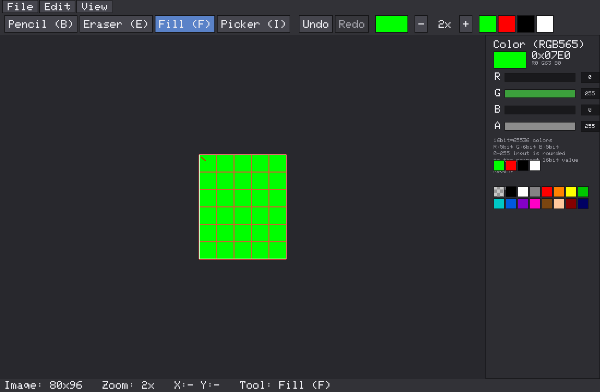

# Pixel Sprite Editor

90年代の2D対戦格闘ゲーム（ストリートファイターIIなど）風のキャラクタースプライトを
作るための、C++製の低解像度ピクセルアート専用エディタです。一般的なペイントソフトでは
なく、「16×16pxのブロックを複数組み合わせて1体のキャラクタースプライトを描く」ことに
特化しています。



## このアプリについて

- キャンバスは**実解像度のピクセルデータ**として保持されます（例: 80×96px）。画面上では
  1x〜32xまで拡大して編集しますが、内部データは常に元の解像度のままです。
- 拡大表示は常に **Nearest Neighbor**（最近傍補間）で、アンチエイリアスや画像補間は
  一切行いません。1クリック = 1ピクセルです。
- 色は **RGB565（16ビットカラー / 65,536色）** のみを扱います。R:5bit / G:6bit / B:5bit
  に丸め込まれた色でしか描画できません（0〜255で入力しても自動的に丸められます）。
- キャンバスは16×16px単位の「ブロック」の集合として扱われ、16px間隔の太いガイド線で
  ブロック境界を確認しながら描けます。
- 背景は透明（アルファ0）で管理され、保存したPNGはRGBA8888・実解像度そのままです。
  グリッドやガイドはあくまで編集画面上の表示であり、PNGには一切書き込まれません。

## 必要な環境

- Linux（Ubuntu 24.04 で開発・動作確認）。CMake / SDL2 が動く環境であれば他OSでも
  基本的にビルド可能です（Windows/macOSは未検証）。
- CMake 3.16以上
- C++17 対応コンパイラ（GCC 13 で確認済み）
- SDL2 開発ライブラリ（`libsdl2-dev`）

Ubuntu / Debian系での依存パッケージインストール例:

```bash
sudo apt-get update
sudo apt-get install -y build-essential cmake libsdl2-dev
```

## 使用ライブラリと採用理由

| ライブラリ | 用途 | 採用理由 |
|---|---|---|
| **SDL2** | ウィンドウ生成・描画・入力 | 依存が軽く、Linux環境に標準的なパッケージ (`libsdl2-dev`) として存在し、`cmake`のconfig-modeにもそのまま対応。Nearest Neighbor拡大（`SDL_HINT_RENDER_SCALE_QUALITY=0` + `SDL_ScaleModeNearest`）や、ピクセル単位のストリーミングテクスチャ更新など、本アプリの要件と相性が良い。 |
| **stb_image.h / stb_image_write.h**（[nothings/stb](https://github.com/nothings/stb)） | PNG読み込み・書き出し | ヘッダオンリーでビルド設定が不要、依存ライブラリが増えない。RGBA8888のPNGを実解像度のまま読み書きできる。`third_party/stb/` にベンダリング済み（Public Domain / MIT license）。 |
| 独自5x7ビットマップフォント（`third_party/font5x7/`、[Adafruit_GFX](https://github.com/adafruit/Adafruit-GFX-Library) 由来） | メニュー・ツールバー・ステータスバー等のUI文字描画 | SDL2_ttfやシステムフォントへの依存を避けるため、コンパイル済みのビットマップフォントデータのみを使用。フォントファイルの有無に左右されず、どの環境でも同じ見た目でビルド・起動できる（BSD license、`third_party/font5x7/LICENSE.txt`参照）。 |

Dear ImGui / SFML / raylib も候補でしたが、「依存を増やさずビルドしやすくする」ことを
優先し、SDL2 + stb + 自前の最小限UI描画という構成にしています。

## ビルド方法

```bash
cmake -S . -B build
cmake --build build
```

実行ファイルは `build/PixelSpriteEditor` に生成されます。

## 起動方法

```bash
./build/PixelSpriteEditor
```

起動すると、デフォルトで 5×6ブロック（80×96px）のキャンバスが開きます。

## 操作方法

### 画面構成

```
+--------------------------------------------------+
| File | Edit | View                               |
+--------------------------------------------------+
| Pencil | Eraser | Fill | Picker | Undo | Redo |...|
| ...Color swatch | Zoom -/+ | Recent colors        |
+--------------------------------------------------+
|                                    | Color panel   |
|            PIXEL CANVAS            | (RGB565)      |
|      (16x16ガイド / 1pxグリッド)    | R/G/B/Aスライダ|
|                                    | 最近使った色   |
|                                    | パレット       |
+--------------------------------------------------+
| Image: 80x96  Zoom: 8x  X:24 Y:37  Tool: Pencil   |
+--------------------------------------------------+
```

### ツール

- **Pencil**: 左クリック/ドラッグで現在色を1pxずつ描画。ドラッグ中は前回位置との間を
  線で補間するため、速く動かしても隙間が空きません。
- **Eraser**: 同様の操作でピクセルを透明（アルファ0）に戻します。
- **Fill**: クリックした位置と同じ色でつながっている領域を4方向接続で塗りつぶします。
- **Eyedropper (Picker)**: クリックしたピクセルの色を現在色として取得します。

1回のドラッグ（マウスダウン〜アップ）は1つのUndo単位として扱われます。

### 色

右側のColorパネルで、現在色をRGB565（R:5bit/G:6bit/B:5bit、計65,536色）として編集
できます。

- スライダーまたは数値ボックス（クリックしてテキスト入力→Enterで確定）で
  R/G/B/A(0〜255)を指定できます。入力値は自動的にRGB565の階調に丸め込まれ、
  実際に描画される色としてプレビューされます。
- 現在色のRGB565パック値（16進数と R5/G6/B5の内訳）を表示します。
- **Recent** に直近使用した色、**Palette** によく使う色のプリセットを用意しています。
  クリックで現在色に切り替えられます。
- Aを0にすると透明色として扱われます。

### 透明背景

キャンバスの透明部分は編集画面上では白/灰色のチェック柄で表示されます
（`View > Transparency Grid` でON/OFF可能）。実際のPNGにはチェック柄は含まれず、
アルファ0の透明ピクセルとして保存されます。

### グリッド / ガイド

- **1px Grid**: 1ピクセルごとの境界を細い線で表示（`View > Pixel Grid`、ショートカット `G`）。
  ズームが小さすぎる（4x未満）ときは自動的に非表示になります。
- **16x16 Guide**: 16pxごとに太い線を表示し、スプライトのブロック境界を確認できます
  （`View > 16x16 Guide`、ショートカット `Shift+G`）。
- どちらもPNG保存時には一切含まれません（保存は常にキャンバスの生ピクセルデータのみ）。

### ズーム / キャンバス移動

- ツールバーの `-` / `+` ボタン、またはマウスホイールでズームできます
  （1x, 2x, 4x, 8x, 16x, 24x, 32x）。常にNearest Neighborで拡大され、ぼかしは
  発生しません。
- **中ボタンドラッグ** または **Spaceキーを押しながら左ドラッグ** でキャンバスを
  スクロールできます。

### 新規作成 (New Canvas)

`File > New` (`Ctrl+N`) で以下のいずれかの方法でキャンバスサイズを指定できます。

- **Pixel Size**: Width / Height をピクセル単位で直接指定（例: 80 × 96）
- **Tile Size**: 16×16ブロック単位で横・縦のブロック数を指定（例: 横5×縦6 → 80×96px）

### PNG保存 / 読み込み

- `File > Save` (`Ctrl+S`) / `Save As` (`Ctrl+Shift+S`) で、キャンバスと同じ実解像度の
  RGBA PNGとして保存します。画面上のズーム倍率に関係なく、常に元の解像度のまま
  保存されます（グリッド・ガイドは含まれません）。
- `File > Open` (`Ctrl+O`) で、カレントディレクトリにある `.png` ファイル一覧から選ぶか、
  パスを直接入力して読み込めます。画像サイズは変更されず、そのままキャンバスの
  解像度になります。

### Undo / Redo

`Ctrl+Z` (Undo) / `Ctrl+Y` (Redo) に対応しています。Pencil・Eraser・Fillの操作を
取り消し・やり直しできます。

## ショートカットキー

| キー | 動作 |
|---|---|
| `B` | Pencilツール |
| `E` | Eraserツール |
| `F` | Fillツール |
| `I` | Eyedropperツール |
| `Ctrl+N` | New Canvas |
| `Ctrl+O` | Open |
| `Ctrl+S` | Save |
| `Ctrl+Shift+S` | Save As |
| `Ctrl+Z` | Undo |
| `Ctrl+Y` | Redo |
| `G` | 1px Grid ON/OFF |
| `Shift+G` | 16x16 Guide ON/OFF |
| マウスホイール | ズームイン/アウト |
| 中ボタンドラッグ / `Space`+左ドラッグ | キャンバス移動 |
| `Esc` | 開いているダイアログを閉じる |

## ファイル構成

```
pixel_art_editer/
├── CMakeLists.txt
├── README.md
├── src/
│   ├── main.cpp          # エントリポイント（+ ヘッドレスセルフテストモード）
│   ├── App.h / .cpp       # アプリ全体の状態（キャンバス/ツール/色/表示設定/ダイアログ）とメインループ
│   ├── Canvas.h / .cpp    # 実解像度のピクセルデータ（RGBAバッファ）
│   ├── Color.h / .cpp     # RGB565量子化ヘルパー
│   ├── Renderer.h / .cpp  # キャンバスの拡大表示・チェッカー柄・グリッド/ガイド描画
│   ├── UI.h / .cpp        # メニュー/ツールバー/カラーパネル/ダイアログ/ステータスバー
│   ├── Font.h / .cpp      # 組み込みビットマップフォントでのテキスト描画
│   ├── Input.h / .cpp     # マウス/キーボード入力→ピクセル座標変換・ショートカット
│   ├── History.h / .cpp   # Undo/Redo（ストローク単位の差分記録）
│   ├── ImageIO.h / .cpp   # PNG読み込み・書き出し（stb_image使用）
│   └── Tools/
│       ├── Tool.h             # ツール共通インターフェース
│       ├── PencilTool.h/.cpp
│       ├── EraserTool.h/.cpp
│       ├── FillTool.h/.cpp
│       ├── EyedropperTool.h/.cpp
│       └── LineUtil.h         # ドラッグ描画の隙間を埋めるBresenham直線補間
└── third_party/
    ├── stb/               # stb_image.h, stb_image_write.h（PNG I/O）
    └── font5x7/            # UI用の組み込みビットマップフォント
```

## 設計メモ（将来拡張について）

現時点ではアニメーションフレーム管理・スプライトシート出力・左右反転・選択範囲・
コピー＆ペースト・レイヤー・パレット保存・プロジェクト保存・オニオンスキンなどは
未実装ですが、以下の分離を意識しているため、将来的に追加しやすい設計にしています。

- `Canvas` は「1枚の実ピクセルデータ」だけを持つ純粋なデータクラスです。将来
  複数の `Canvas`（フレームやレイヤー）を並べて管理する形に拡張しやすくなっています。
- 描画ツールは `Tool` インターフェースの実装として分離されているため、新しいツール
  （選択範囲、コピー＆ペーストなど）を既存コードに手を入れずに追加できます。
- `History` はピクセル単位の差分（ストローク）を記録する設計のため、将来レイヤーや
  フレームをまたぐ操作にも応用しやすくなっています。
- 保存/読み込みは `ImageIO` に閉じているため、スプライトシート書き出しなどの
  フォーマット追加もこのモジュールを拡張するだけで対応できます。

## 既知の制限

- ファイルを開く/保存するダイアログは簡易的な自前実装で、OSネイティブのファイル
  選択ダイアログではありません（カレントディレクトリの `.png` 一覧 + パス直接入力）。
- レイヤー、アニメーションフレーム、選択範囲、コピー＆ペーストは未実装です。
